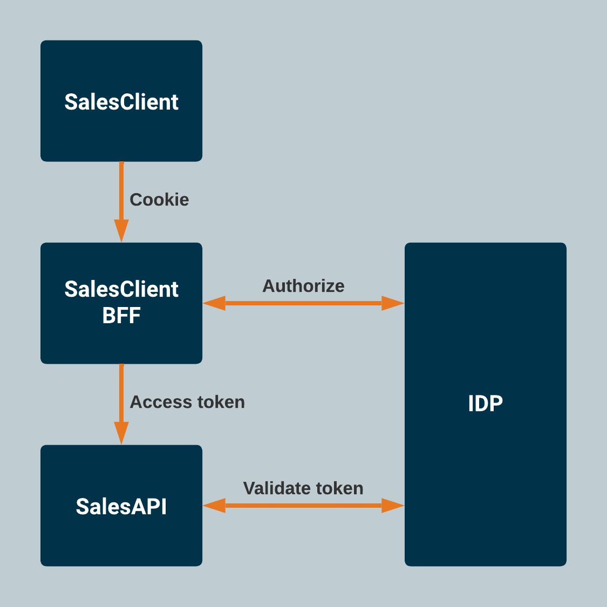

# Intro

This repo contains code and documentation for the "Secure by Design" and "Defence in Depth" workshop. It is divided in to three parts: [SalesClient](SalesClient), [SalesApi](SalesApi) and [Tests](Tests). Each of the directories has a separate README-file containing the workshop guides. For each step in the individual parts, there are sub directories containing a solution to the tasks given. If you didn't manage to complete an assignment, you can start the next one using the solution-directory for the previous step. When starting 'Step 2 - Token transformation' in the SalesApi part, you can use the '1-token-validation'-directory as a starting point.

## Architecture

The application has a same-site hosting setup. This means that the backend and frontend is hosted as the same site. To account for this in development an SPA-proxy is used.

### IdP

We have setup a Idp instance using Auth0 which we will use throughout the workshop. You will get the details from the course instructors. This will be need both in the client/BFF and the API parts of the application.

## Workshop

The workshop is divided into 3 main parts. Follow the links for the workshop guide for each step

- [**Part 1 - Secure API**](./SalesApi)
- [**Part 2 - Testing**](./Tests)
- [**Part 3 - Secure Client**](./SalesClient)

## Workshop done

Congrats, you are now done. If you have time left, feel free to improve your app.

Suggested improvements:

- Add Content Security Policy (CSP) for protection against cross-site scripting (XSS)
- Implement a server side session store by implementing the `ITicketStore` interface. Can be configured in cookie options.

For additional suggestions for improvements, ask your course teachers.
