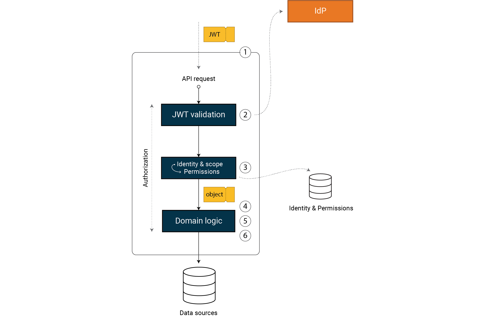

# Workshop guide - Secure API

- [Workshop guide - Secure API](#workshop-guide---secure-api)
- [Introduction](#introduction)
- [Step 0](#step-0)
- [Step 1 - Token validation](#step-1---token-validation)
  - [Add JWT bearer authentication](#add-jwt-bearer-authentication)
  - [Add authorization](#add-authorization)
  - [Add middleware](#add-middleware)
  - [Verify token validation](#verify-token-validation)
- [Step 2 – Transform the access token to permissions](#step-2--transform-the-access-token-to-permissions)
  - [Transform to local permissions](#transform-to-local-permissions)
  - [Get market permission form IUserPermissionRepository](#get-market-permission-form-iuserpermissionrepository)
- [Step 3 - validate data in the request](#step-3---validate-data-in-the-request)
- [Step 4 - Validate permission to perform the operation](#step-4---validate-permission-to-perform-the-operation)
- [Step 5 - Validate permission to access the data](#step-5---validate-permission-to-access-the-data)
- [Step 6 - Secure by Design](#step-6---secure-by-design)
  - [Domain primitives](#domain-primitives)
  - [Handling errors](#handling-errors)
  - [Handling permissions securely](#handling-permissions-securely)
- [Workshop summary](#workshop-summary)

# Introduction

This part of the course will guide you through how you can create a secure web api using C# and dotnet 8. We base the model on principles of Zero Trust, Least Privilege, and design ideas from the book Secure by Design. The solution will be somewhat opinionated, the same level of security can of course be achieved with other styles and implementation choices. The model and concepts are general and you could easily implement them using other programming languages and frameworks. This course focus on what you should do within the context of a web api and ignores all the things you should we have in front of your API in the form of infrastructure protection, e.g. a firewall, WAF, API gateway or similar.

To build a robust API we believe you have to implement a set of security mechanisms within you application, independent of framework and implementation details. This is not a complete list, as there are other things you should consider in addition. But if you have these main point covered you can be fairly assured that your system is secured against a lot of attack vectors.
We will implement the following mechanisms step by step:

- Validating that the access token in the request is correct
- Transform the token into a permission model adapted to our domain
- Validate that the data in the request is correct
- Validate that the user has permissions to execute the operation
- Validate that the user is allowed to query or change the data



In addition to these steps we will implement Secure by Design principles that will make the application more resilient.

# Step 0

Start by opening the `SalesApi.0-starting-point` project in your IDE of choice. Run the application either from the IDE or from the CLI using `dotnet run`. After starting the project test that the API responds. There is a [requests file](requests.http) you can use (e.g. by installing Rest Client extensions in VS Code). Alternatively use curl, postman or any other tool you are comfortable with. Issue a GET-request to `https://localhost:7094/api/product`. It should return a list of static products.

# Step 1 - Token validation

The first step to a secure API is adding JWT middleware. This is not something you should implement on your own, it should only be configuration. In dotnet you will use `AddAuthentication`, `AddJwtBearer` and `AddAuthorization` methods to register the middlewares needed and `UseAuthentication`+`UseAuthorization` to add them to the pipeline. The JWT middleware has secure defaults, with validation according to the JWT spec, you need to configure Authority and Audience to make it work correctly against the IdP. The config values are included in appsettings.json.

## Add JWT bearer authentication
Lets start by adding authentication. Add `AddAuthentication` and `AddJwtBearer` to your services in `Program.cs`.

```csharp
builder.Services.AddAuthentication(JwtBearerDefaults.AuthenticationScheme)
    .AddJwtBearer(options =>
    {
        // Configure jwt bearer options
    });
```

Configure the jwt bearer options like this:
- Bind the appsettings section `JwtBearerOptions` to the options with `builder.Configuration.Bind("JwtBearerOptions", options)`
- We should always validate the type claim of a token. This is not done by default. The type claim might differ from IDP to IDP. The best is when the IDP not only specifies that the token is a jwt token, but also that it is an access token. This is done by a `typ` claim with value `at+jwt`. Validating this will make sure the that the token is an id-token or something else. Not all IDPs do this, and Auth0 is one of them. We get a `typ` claim with value `JWT`. We should validate that with: `options.TokenValidationParameters.ValidTypes = new[] { "JWT" };`

<details>
<summary><b>Spoiler (Full code)</b></summary>
<p>

```csharp
builder.Services.AddAuthentication(JwtBearerDefaults.AuthenticationScheme)
    .AddJwtBearer(options =>
    {
        builder.Configuration.Bind("JwtBearerOptions", options);
        options.TokenValidationParameters.ValidTypes = new[] { "JWT" };
    });
```

</p>
</details>

## Add authorization
We want to make sure that all our endpoints use our jwt bearer authentication. We do not want to relay on remembering to add the `[Authorize]` attribute to all controllers/endpoints. We want authentication to be opt-out rather than opt-in. This is done by adding authorization and configuring a default and fallback policy. In `Program.cs` add authorization:

```csharp
builder.Services.AddAuthorization(options =>
{
    // Build policy and and set it as a default- and fallback-policy
});
```

Build the policy using `AuthorizationPolicyBuilder`. Build it so that it requires an authenticated user and that the user is authenticated using the jwt bearer scheme. Set the `DefaultPolicy` and  `FallbackPolicy` options to the build policy.

<details>
<summary><b>Spoiler (Full code)</b></summary>
<p>

```csharp
builder.Services.AddAuthorization(options =>
{
    var policy = new AuthorizationPolicyBuilder()
        .RequireAuthenticatedUser()
        .AddAuthenticationSchemes(JwtBearerDefaults.AuthenticationScheme)
        .Build();

    options.DefaultPolicy = policy;
    options.FallbackPolicy = policy;
});
```

</p>
</details>

## Add middleware
Add authorization and authentication middleware after `app.UseHttpsRedirection()` in `Program.cs`. The order of these middlewares matter. Remember that we need to know who the user is (authentication) before we determines what the user has access to (authorization)

```csharp
app.UseAuthentication();
app.UseAuthorization();
```

## Verify token validation
To test that it works you need to acquire a valid token. This can be done using the following request.

```
POST https://omegapoint-norge-workshop.eu.auth0.com/oauth/token
content-type: application/json

{
    "client_id":"<ask course instructor>",
    "client_secret":"<ask course instructor>",
    "audience":"sales-api",
    "grant_type":"client_credentials",
    "scope": "products.read"
}
```

Then you can test the API using the token from the response, by adding a header and calling the API.

```
GET https://localhost:7094/api/product/234QWE
Authorization: Bearer <insert token here>
```

Also test that a request with no token responds with `401 Unauthorized`

# Step 2 – Transform the access token to permissions

This step can be done either as a continuation of step 1 or the 1-token-validation project can be used as a starting point.

The purpose of this step to transform the access token into local permissions and to add any additional permissions that the users might have that is not represented in the access token. This might be permissions stored in the system or a local IDP.

In ASP.NET, we often implement this by using a claims transformation class. Create a new class named `ClaimsTransformation` in the `Infrastructure` folder of your project. Copy the below code to the class:

```csharp
internal class ClaimsTransformation(IUserPermissionRepository userPermissionRepository) : IClaimsTransformation
{
    public async Task<ClaimsPrincipal> TransformAsync(ClaimsPrincipal principal)
    {
        await Task.CompletedTask;

        if (principal.Identity?.IsAuthenticated == true)
        {
            var identity = new ClaimsIdentity(principal.Identity);

            // TODO 1. Transform scopes to local permissions
            // TODO 2. Get market permission form IUserPermissionRepository

            return new ClaimsPrincipal(identity);
        }

        return principal;
    }

    private void AddPermissionIfScope(ClaimsIdentity identity, string scope, Claim claim)
    {
        if (identity.Claims.Any(claim => claim.Type == "scope" && claim.Value.Split(' ').Contains(scope)))
        {
            identity.AddClaim(claim);
        }
        else if (identity.Claims.Any(c => c.Type == "scope" && c.Value == scope))
        {
            identity.AddClaim(claim);
        }
    }
}
```

Also register it in `Program.cs` for ASP.NET to pick it up: `builder.Services.AddSingleton<IClaimsTransformation, ClaimsTransformation>();`

## Transform to local permissions
Lets implement the first TODO. We highly recommend prefixing the local permissions so that you can easily separate them from the standard OIDC and JWT standards claims. We choose the `urn:permissions` prefix for permissions. Note that representing permissions as .NET Claims may not be optimal, but it is commonly used. We will address this in the section “Secure by design”.

In the code add the claim `urn:permissions:products:read` with value `true` if the claim `products.read` is present. You can use the `AddPermissionIfScope` method provided. Do the same for `urn:permissions:products:write` if the claim `products.write` is provided.

<details>
<summary><b>Spoiler (Full code)</b></summary>
<p>

```csharp
internal class ClaimsTransformation(IUserPermissionRepository userPermissionRepository) : IClaimsTransformation
{
    public async Task<ClaimsPrincipal> TransformAsync(ClaimsPrincipal principal)
    {
        await Task.CompletedTask;

        if (principal.Identity?.IsAuthenticated == true)
        {
            var identity = new ClaimsIdentity(principal.Identity);

            AddPermissionIfScope(identity, "products.read", new Claim("urn:permissions:products:read", "true"));
            AddPermissionIfScope(identity, "products.write", new Claim("urn:permissions:products:write", "true"));

            return new ClaimsPrincipal(identity);
        }

        return principal;
    }

    private void AddPermissionIfScope(ClaimsIdentity identity, string scope, Claim claim)
    {
        if (identity.Claims.Any(claim => claim.Type == "scope" && claim.Value.Split(' ').Contains(scope)))
        {
            identity.AddClaim(claim);
        }
        else if (identity.Claims.Any(c => c.Type == "scope" && c.Value == scope))
        {
            identity.AddClaim(claim);
        }
    }
}
```

</p>
</details>

## Get market permission form IUserPermissionRepository
We sell our products on different markets. Some products can belong to the Norwegian market, and some to the Swedish market etc. We want to add access control to this property. Imagine we have a user database that has these permissions. We have created a repository named `UserPermissionRepository` with an interface `IUserPermissionRepository` that represents this.

Lets get the user id from the claims. This is represented by the `sub` claim. Use this id to get the market permissions for the current user: `await userPermissionRepository.GetUserMarketPermissions(sub)`. For each market returned by the repository, add a claim with name `urn:permissions:market` and the market as value.

<details>
<summary><b>Spoiler (Full code)</b></summary>
<p>

```csharp
internal class ClaimsTransformation(IUserPermissionRepository userPermissionRepository) : IClaimsTransformation
{
    public async Task<ClaimsPrincipal> TransformAsync(ClaimsPrincipal principal)
    {
        await Task.CompletedTask;

        if (principal.Identity?.IsAuthenticated == true)
        {
            var identity = new ClaimsIdentity(principal.Identity);

            AddPermissionIfScope(identity, "products.read", new Claim("urn:permissions:products:read", "true"));
            AddPermissionIfScope(identity, "products.write", new Claim("urn:permissions:products:write", "true"));

            var sub = principal.FindFirstValue("sub");
            var userPermission = await userPermissionRepository.GetUserMarketPermissions(sub);
            foreach (var permission in userPermission) 
            {
                identity.AddClaim(new Claim("urn:permissions:market", permission));
            }

            return new ClaimsPrincipal(identity);
        }

        return principal;
    }

    private void AddPermissionIfScope(ClaimsIdentity identity, string scope, Claim claim)
    {
        if (identity.Claims.Any(claim => claim.Type == "scope" && claim.Value.Split(' ').Contains(scope)))
        {
            identity.AddClaim(claim);
        }
        else if (identity.Claims.Any(c => c.Type == "scope" && c.Value == scope))
        {
            identity.AddClaim(claim);
        }
    }
}
```

</p>
</details>

Before moving on, we want to emphasize the importance of striking the right balance between what the token contains and the permissions we need for access control. How we model identity and scopes are essential for how fine-grained our access control can be and how we can adapt as the system grows.

# Step 3 - validate data in the request
All parts of the request are untrusted and need to be validated. For the endpoint in our controller, we have one parameter: the product identifier. In our case, the identifier is not an arbitrary string of any size! It can contain only letters and digits and be ten characters or less. If the input string does not follow those rules, we can immediately return a `400 Bad Request`. This input validation will make injection attacks a lot harder.

Lets edit the `ProductController` to validate the request and return 400 Bad Request if anything is not correct.

<details>
<summary><b>Spoiler (Full code)</b></summary>
<p>

```csharp
[HttpGet("{id}", Name = "GetProduct")]
public async Task<ActionResult<IEnumerable<ProductDTO>>> GetById([FromRoute] string id)
{
    if (string.IsNullOrEmpty(id) || id.Length > 10 || !id.All(char.IsLetterOrDigit))
    {
        return BadRequest("Parameter id is not well formed");
    }

    return Ok(mapper.Map<ProductDTO>(await productRepository.GetBy(id)));
}
```

</p>
</details>

In our example, the parameter is of type string because it can contain digits and letters, according to our business rules. But for other parameters like dates, numbers of items, etc., we should utilize the fact that the C# is a strongly typed language and use the corresponding types like DateTime and int. Using string should be the last type chosen for input parameters.

Selecting types like DateTime and int will reduce attack vectors significantly compared to a string, but we should still verify that the values meet our requirements. For example, it might not make sense to accept dates 100 years into the future, negative count values, etc. The book Secure by Design, chapters 4 and 5, will provide more details.

# Step 4 - Validate permission to perform the operation
In step 2, we transformed our permissions. We base the permission to perform an operation on the transformed permissions in our domain code and not directly with scopes and user identity.

Lets implement this in the `ProductController` just below the data validation. Check that the user has the claim `urn:permissions:products:read` with value `true` and return `401 Forbidden` if the claim is not present with the required value.

<details>
<summary><b>Spoiler (Full code)</b></summary>
<p>

```csharp
[HttpGet("{id}", Name = "GetProduct")]
public async Task<ActionResult<IEnumerable<ProductDTO>>> GetById([FromRoute] string id)
{
    if (string.IsNullOrEmpty(id) || id.Length > 10 || !id.All(char.IsLetterOrDigit))
    {
        return BadRequest("Parameter id is not well formed");
    }

    var canRead = User.HasClaim(c => c.Type == "urn:permissions:products:read" && c.Value == "true");

    if (!canRead)
    {
        return Forbid();
    }

    return Ok(mapper.Map<ProductDTO>(await productRepository.GetBy(id)));
}
```

</p>
</details>

# Step 5 - Validate permission to access the data

We need to validate access to the actual data that the request will read or modify. Sometimes we can validate access by looking at the request, and other times we need to retrieve the data before deciding.

In our example, we need to retrieve the product before verifying that the user has access to the product’s market.

We can choose between HTTP status codes `403 Forbidden` and `404 Not Found` if we fail to validate permission to the data, depending on if we want to reveal that data exists or not, respectively.

Lets also check if the requested product exists and return `404 Not Found` in that case.

<details>
<summary><b>Spoiler (Full code)</b></summary>
<p>

```csharp
[HttpGet("{id}", Name = "GetProduct")]
public async Task<ActionResult<IEnumerable<ProductDTO>>> GetById([FromRoute] string id)
{
    if (string.IsNullOrEmpty(id) || id.Length > 10 || !id.All(char.IsLetterOrDigit))
    {
        return BadRequest("Parameter id is not well formed");
    }

    var canRead = User.HasClaim(c => c.Type == "urn:permissions:products:read" && c.Value == "true");

    if (!canRead)
    {
        return Forbid();
    }

    var product = await productRepository.GetBy(id);

    if (product == null)
    {
        return NotFound();
    }

    if (!User.HasClaim(claim =>
            claim.Type == "urn:permissions:market" &&
            claim.Value == product.MarketId))
    {
        return NotFound();
    }

    return Ok(mapper.Map<ProductDTO>(product));
}
```

</p>
</details>

Validation of access to data is often overlooked and is called Insecure Direct Object Reference vulnerability (IDOR). Failure to validate data access means the attacker can access any product by iterating product identifiers. Note that making identifiers hard to guess using randomized values or GUID does not mitigate this vulnerability. It will make it harder for the attacker, but identifiers often leak, and you can’t revoke access.

# Step 6 - Secure by Design

So far in the workshop we have added authentication with a third party identity provider, authorization by transforming the user's access token into a permission model and validated requests. The purpose of this step is to refactor the code in a way that makes it both more readable and more secure. We are going to use concepts from Secure by Design to do this. We want to use design patterns that also helps secure our code.

## Domain primitives
To start, we introduce a `domain primitive` in the ProductId class that will validate input data and throws an exception if not valid. Create a folder in the `Domain`-folder called `DomainPrimitives` and create a class within it named `ProductId` in its own separate file.

```csharp
namespace SalesApi.Domain.DomainPrimitives;

public class ProductId
{
    public ProductId(string id)
    {
        AssertValid(id);
        Value = id;
    }

    public string Value { get; private set; }
    public static bool IsValid(string id)
    {
        return !string.IsNullOrEmpty(id) && id.Length < 10 && id.All(char.IsLetterOrDigit);
    }

    private static void AssertValid(string id)
    {
        if (!IsValid(id))
        {
            throw new ArgumentException(id);
        }
    }
}

```

If we look closely at this class we can notice that it encapsulates the primitive string with our domain logic. When we now have a ProductId in hand, we know that it is not null and that it conforms with our understanding of a ProductId. There is no way to edit the ProductId without going past the constructor since the value has a private setter. So we can say that this class is immutable. If you or some other developer on the team tries to create an invalid ProductId an Exception will be thrown.

Encapsulating in this manner is what we call domain primitives in Secure by Design. Read more about this in the Secure by Design book chapter 5.

Now we need to refactor our code to use this ProductId.
- Go to the `Product` class and change the type of the `ProductId` property from `string` to `ProductId`

<details>
<summary><b>Spoiler (Full code)</b></summary>
<p>

```csharp
public class Product(ProductId id, string name, decimal price, string marketId)
{
    public ProductId Id { get; private set; } = id;
    public string Name { get; private set; } = name;
    public decimal Price { get; private set; } = price;
    public string MarketId { get; private set; } = marketId;

    public void UpdatePrice(decimal newPrice)
    {
        Price = newPrice;
    }
}
```

</p>
</details>

- Update the `ProductRepository` to use this new type. Remember to update the signature of the `GetBy` method to use the `ProductId` instead of the inputted `string`

<details>
<summary><b>Spoiler (Full code)</b></summary>
<p>

```csharp
public class ProductRepository : IProductRepository
{
    private readonly List<Product> _products = [
        new(
            new ProductId("123GQWE"),
            "Product 2",
            12.5m,
            "no"),
        new(
            new ProductId("234QWE"),
            "Product 1",
            9m,
            "no"),
    ];

    public Task<List<Product>> GetAllAvailable()
    {
        return Task.FromResult(_products);
    }

    public Task<Product?> GetBy(ProductId productId)
    {
        return Task.FromResult(_products.FirstOrDefault(p => p.Id.Value == productId.Value));
    }
}
```

</p>
</details>

- Update the validation in `ProductController` to use the static `IsValid` method and the `ProductId`. The controller should still accept a `string` as a input, but a `ProductId` should be created and inserted into the `GetBy` method of the repository.

<details>
<summary><b>Spoiler (Full code)</b></summary>
<p>

```csharp
[HttpGet("{id}", Name = "GetProduct")]
public async Task<ActionResult<IEnumerable<ProductDTO>>> GetById([FromRoute] string id)
{
    if (!ProductId.IsValid(id))
    {
        return BadRequest("Id is not valid.");
    }

    var canRead = User.HasClaim(c => c.Type == "urn:permissions:products:read" && c.Value == "true");

    if (!canRead)
    {
        return Forbid();
    }

    var product = await productRepository.GetBy(new ProductId(id));

    if (product == null)
    {
        return NotFound();
    }

    if (!User.HasClaim(claim =>
            claim.Type == "urn:permissions:market" &&
            claim.Value == product.MarketId))
    {
        return NotFound();
    }

    return Ok(mapper.Map<ProductDTO>(product));
}
```

</p>
</details>

- Update the `MappingProfile` to map from the value of the domain primitive:

```csharp
public class MappingProfile : Profile
{
    public MappingProfile()
    {
        CreateMap<Product, ProductDTO>()
            .ForMember(dest => dest.Id, opt => opt.MapFrom(src => src.Id.Value));
    }
}
```

There are other properties in the `Product` model that should be encapsulated in a domain primitive, but we wont implement them all in this workshop. The productId serves as an example on how we would do this for a property.

## Handling errors
So far we have all our code in the controller. This is neither a good nor scalable solution. We want to refactor this code into a `ProductService`. Lets create an interface named `IProductService` like below. We can place it a file called `IProductService.cs` in the folder `Domain/Services/`

```csharp
namespace SalesApi.Domain.Services;

public interface IProductService
{
    Task<(ReadDataResult, List<Product>?)> GetAllAvailableProducts();
    Task<(ReadDataResult, Product?)> GetWith(ProductId id);
}
```

Also create the enum `ReadDataResult` in its own file as shown below, and place it in the `Domain/Model/` folder:

```csharp
namespace SalesApi.Domain.Model;

public enum ReadDataResult
{
    Success = 0,
    NotFound,
    NoAccessToData,
    NoAccessToOperation,
    InvalidData
}
```

Error and exception handling is a vital API security aspect. To detect intrusions, we need a high-quality system without false positives that hide malicious activity. Well-designed clients to the API will never cause input data violations or NoAccessToData events.

Correct HTTP status codes are essential for security. An unexpected rise in 400, 401, 403, or 404 might indicate an attack.

Note that the service class does not return HTTP status codes. Remember that you can use our service from contexts where HTTP status codes are irrelevant, like message bus integrations.

We only raise exceptions when something we did not design for has happened. One example of this strategy is the `ProductId` class, where `IsValid()` does not throw, but the constructor does. Our design always validates input data before we create domain primitives, so the constructor should never fail and thus throws an exception.

We recommend reading chapter 9 in Secure by Design for more in-depth reasoning about this.

With this in mind, lets implement the `ProductService`. Create the class in the code and implement the `IProductService` interface. Use the following code as a starting point, and implement the missing part.

```csharp
public class ProductService(IProductRepository productRepository, IHttpContextAccessor contextAccessor) : IProductService
{
    public async Task<(ReadDataResult, List<Product>?)> GetAllAvailableProducts()
    {
        var user = contextAccessor.HttpContext!.User;

        var canRead = user.HasClaim(c => c.Type == "urn:permissions:products:read" && c.Value == "true");
        if (!canRead)
        {
            return (ReadDataResult.NoAccessToOperation, null);
        }

        var products = await productRepository.GetAllAvailable();

        var allowedProducts = products.Where(product => user.HasClaim(claim =>
                claim.Type == "urn:permissions:market" &&
                claim.Value == product.MarketId)).ToList();

        return (ReadDataResult.Success, allowedProducts);
    }

    public async Task<(ReadDataResult, Product?)> GetWith(ProductId id)
    {
        var user = contextAccessor.HttpContext!.User;

        // Implement this
    }
}
```

<details>
<summary><b>Spoiler (Full code)</b></summary>
<p>

```csharp
public class ProductService(IProductRepository productRepository, IHttpContextAccessor contextAccessor) : IProductService
{
    public async Task<(ReadDataResult, List<Product>?)> GetAllAvailableProducts()
    {
        var user = contextAccessor.HttpContext!.User;

        var canRead = user.HasClaim(c => c.Type == "urn:permissions:products:read" && c.Value == "true");
        if (!canRead)
        {
            return (ReadDataResult.NoAccessToOperation, null);
        }

        var products = await productRepository.GetAllAvailable();

        var allowedProducts = products.Where(product => user.HasClaim(claim =>
                claim.Type == "urn:permissions:market" &&
                claim.Value == product.MarketId)).ToList();

        return (ReadDataResult.Success, allowedProducts);
    }

    public async Task<(ReadDataResult, Product?)> GetWith(ProductId id)
    {
        var user = contextAccessor.HttpContext!.User;
        var canRead = user.HasClaim(c => c.Type == "urn:permissions:products:read" && c.Value == "true");

        if (!canRead)
        {
            return (ReadDataResult.NoAccessToOperation, null);
        }

        var product = await productRepository.GetBy(id);

        if (product is null) return (ReadDataResult.NotFound, null);

        if (!user.HasClaim(claim =>
                claim.Type == "urn:permissions:market" &&
                claim.Value == product.MarketId))
        {
            return (ReadDataResult.NoAccessToData, null);
        }

        return (ReadDataResult.Success, product);
    }
}
```

</p>
</details>

Also register the `ProductService` in `Program.cs`
```csharp
builder.Services.AddTransient<IProductService, ProductService>();
```

Now lets use that service from the `ProductController`. Refactor the controller to use the `ProductService`.

We want the ProductController to return the proper HTTP responses based on the ReadDataResult from the ProductService. The possible HTTP responses we can return in ASP.NET is:

```csharp
OK()
NotFound()
Forbid()
BadRequest()
```

Hint: use a switch expression to evaluate the `ReadDataResult` and return the correct http status code.

<details>
<summary><b>Spoiler (Full code)</b></summary>
<p>

```csharp
[ApiController]
[Route("api/product")]
public class ProductsController(IMapper mapper, IProductService productService) : ControllerBase
{
    [HttpGet("", Name = "GetProducts")]
    public async Task<ActionResult<IEnumerable<ProductDTO>>> GetAll()
    {
        var (result, products) = await productService.GetAllAvailableProducts();

        switch (result)
        {
            case ReadDataResult.NoAccessToOperation:
                return Forbid();
            case ReadDataResult.NotFound:
            case ReadDataResult.NoAccessToData:
                return NotFound();
            case ReadDataResult.InvalidData:
                return BadRequest("Invalid data.");
            case ReadDataResult.Success:
                return Ok(mapper.Map<IEnumerable<ProductDTO>>(products));
            default:
                throw new InvalidOperationException($"Result kind {result} is not supported");
        }
    }

    [HttpGet("{id}", Name = "GetProduct")]
    public async Task<ActionResult<IEnumerable<ProductDTO>>> GetById([FromRoute] string id)
    {
        if (!ProductId.IsValid(id))
        {
            return BadRequest("Id is not valid.");
        }

        var (result, product) = await productService.GetWith(new ProductId(id));

        switch (result)
        {
            case ReadDataResult.NoAccessToOperation:
                return Forbid();
            case ReadDataResult.NotFound:
            case ReadDataResult.NoAccessToData:
                return NotFound();
            case ReadDataResult.InvalidData:
                return BadRequest("Invalid data.");
            case ReadDataResult.Success:
                return Ok(mapper.Map<ProductDTO>(product));
            default:
                throw new InvalidOperationException($"Result kind {result} is not supported");
        }
    }
}
```

</p>
</details>

You do not have to use Domain-Driven Design (DDD) to create a secure API. But it is important to clearly identify the trust boundaries and keep domain-specific logic in the domain. Even if we do basic authorization and validation of some basic domain rules in the web layer, using ASP.NET Core attributes or in a reverse-proxy or WAF in front of us, we need to do this in our domain as well. And we should avoid duplicating more advanced domain rules outside of the domain.

## Handling permissions securely
As mentioned earlier, representing permissions as .NET Claims may not be optimal. In this section we will try to do something about that. Lets create a `IPermissionService`:

```csharp
public interface IPermissionService
{
    bool CanReadProducts { get; }

    bool CanWriteProducts { get; }

    string MarketId { get; }

    string? UserId { get; }

    bool HasPermissionToMarket(string requestedMarket);
}
```

This service enables us to represent permissions in a strongly-typed way that suits our domain. Lets implement this in a class we name `HttpContextPermissionService`. This service will replace our previously coded `ClaimsTransformation`, so you can delete that class.

```csharp
using System.Security.Claims;
namespace SalesApi.Domain.Services;

public class HttpContextPermissionService : IPermissionService
{
    public HttpContextPermissionService(IHttpContextAccessor contextAccessor, IUserPermissionRepository userPermissionRepository)
    {
        var principal = contextAccessor.HttpContext?.User;

        if (principal == null)
        {
            if (contextAccessor.HttpContext == null)
            {
                throw new ArgumentException("HTTP Context is null", nameof(contextAccessor));
            }

            throw new ArgumentException("User object is null", nameof(contextAccessor));
        }

        UserId = principal.FindFirstValue("sub");

        // It is important to honor any scope that affect our domain
        IfScope(principal, "products.read", () => CanReadProducts = true);
        IfScope(principal, "products.write", () => CanWriteProducts = true);

        if (UserId is not null)
        {
            var userPermissions = userPermissionRepository.GetUserMarketPermissions(UserId).GetAwaiter().GetResult();
            MarketId = userPermissions.FirstOrDefault();
        }
    }

    public bool CanReadProducts { get; private set; }

    public bool CanWriteProducts { get; private set; }

    public string? MarketId { get; private set; }

    public string? UserId { get; private set; }

    public string? ClientId { get; private set; }

    public bool HasPermissionToMarket(string requestedMarket)
    {
        if (MarketId is null) return false;
        return string.Equals(MarketId, requestedMarket, StringComparison.OrdinalIgnoreCase);
    }

    private static void IfScope(ClaimsPrincipal principal, string scope, Action action)
    {
        //Scopes can be a space separated list of scopes, so we need to split and check each scope
        if (principal.Claims.Any(claim => claim.Type == "scope" && claim.Value.Split(' ').Contains(scope)))
        {
            action();
        }

        if (principal.HasClaim(claim => claim.Type == "scope" && claim.Value == scope))
        {
            action();
        }
    }
}
```

Now switch out the `IHttpContextAccessor` in the `ProductService` to use the newly created `IPermissionService`

<details>
<summary><b>Spoiler (Full code)</b></summary>
<p>

```csharp
public class ProductService(IProductRepository productRepository, IPermissionService permissionService) : IProductService
{
    public async Task<(ReadDataResult, List<Product>?)> GetAllAvailableProducts()
    {
        if (!permissionService.CanReadProducts)
        {
            return (ReadDataResult.NoAccessToOperation, null);
        }

        var products = await productRepository.GetAllAvailable();

        var allowedProducts = products
            .Where(product => permissionService.HasPermissionToMarket(product.MarketId))
            .ToList();

        return (ReadDataResult.Success, allowedProducts);
    }

    public async Task<(ReadDataResult, Product?)> GetWith(ProductId id)
    {
        if (!permissionService.CanReadProducts)
        {
            return (ReadDataResult.NoAccessToOperation, null);
        }

        var product = await productRepository.GetBy(id);

        if (product is null) return (ReadDataResult.NotFound, null);

        if (!permissionService.HasPermissionToMarket(product.MarketId))
        {
            return (ReadDataResult.NoAccessToData, null);
        }

        return (ReadDataResult.Success, product);
    }
}
```

</p>
</details>

Lastly we need to register the `HttpContextPermissionService` in `Program.cs`
```csharp
builder.Services.AddScoped<IPermissionService, HttpContextPermissionService>();
```

The transformation from token claims to permissions has moved from the ClaimsTransformation class to this service with this approach. This strongly-typed solution might be a better approach when handling more complex permission models and doing external lookups and caching.

Note that this kind of code lends itself nicely to unit tests. You can find examples of tests focusing on security in the repo; good test coverage is vital for security-critical code like this.

# Workshop summary
From an API perspective we have now done what we can. For a more rich solution to this domain including more domain primitives look at the `SalesApi.completed` project.