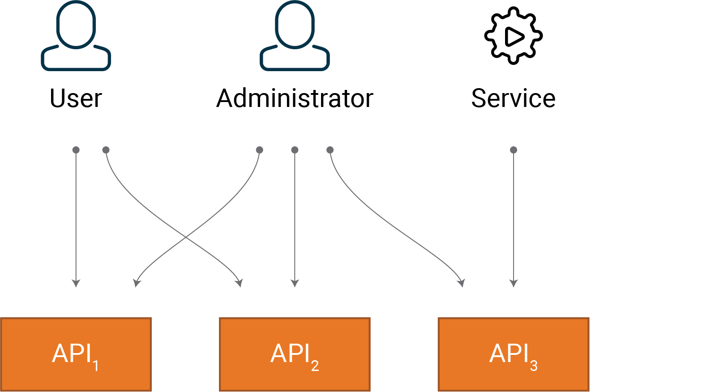

# Workshop Guide: Testing

- [Workshop Guide: Testing](#workshop-guide-testing)
- [Introduction](#introduction)
  - [Security Requirements](#security-requirements)
- [Testing Part 1 - Unit Tests](#testing-part-1---unit-tests)
  - [Step 0](#step-0)
  - [Step 1 - ProductId Tests](#step-1---productid-tests)
  - [Step 2 - ProductService Tests](#step-2---productservice-tests)
  - [Step 3 - ProductController Tests](#step-3---productcontroller-tests)
- [Testing Part 2 - Integration Tests](#testing-part-2---integration-tests)
    - [Step 0 - Add client-secrets to Test Config](#step-0---add-client-secrets-to-test-config)
  - [Step 1 - BaseTests class and Authenticating with the API](#step-1---basetests-class-and-authenticating-with-the-api)
  - [Step 2 - Product Tests](#step-2---product-tests)
- [Step ∞ - Create more tests](#step----create-more-tests)

# Introduction

This part of the course will guide you through how you can write tests for the web API created earlier in the workshop. These tests will ensure your application follows defence-in-depth design principles. 
In this test project we will implement unit tests and integration tests. These are located in the Unit and System folders respectively.

The unit tests, located in the `./Unit`-folder will test the logic of individual units/methods within the application. In order to properly test only one unit at a time, dependencies should be mocked. Put simply: When we are testing a method, we only want to test the code within that method. Therefore, if that method relies on other parts of our codebase, we will replace those dependencies with dummies using a mocking library.

The integration tests, located in the `./System`-folder will test how units work with each other. In this workshop, we will focus these tests around the security in the API controllers and their integration with the underlying data services. More specifically, we can test this by sending various requests to the API and checking what data is available to us with different levels of authentication.


## Security Requirements

If we think of security vulnerabilities as bugs, then security is just another non-functional requirement of our application and should be part of quality assurance (QA). The IT industry has well-established patterns and practices for QA, where one is Test Driven Development (TDD).

To illustrate the need for explicitly defined security requirements and proper testing of these requirements within our application, lets consider the following scenario:

    We have a system with three APIs and three types of clients that need to access one or more of these APIs



To define all user functionality in one requirement we could state the following:
- Users should be able to consume the APIs they need to provide the required user functionality.

This would meet all functional requirements but from a security point of view, it does not ensure proper access control and violates the principle of least privilege because some roles are able to access resources only intended for other roles.

To address this issue, we could specify our requirement as:
- Users should _only_ be able to consume the APIs they need to provide the required user functionality.

This sounds easy and completely obvious, but teams often fail to identify the test cases needed to avoid vulnerabilities. So how do we verify that users are ___only___ able to access the resource they absolutely need? A common practice is to add negative test cases such as:
- Regular users should _not_ be able to access API3.

This ensures that regular users are only able to access API1 and API2, and similar test cases should be applied for the other user types. 


# Testing Part 1 - Unit Tests

First we will create unit tests for the application, ensuring that each individual component of our Web API works as intended.

## Step 0

The test project is located in the `Tests`-folder and is named `Tests.0-starting-point`. You can start by running the tests in this project by executing `dotnet test` in the CLI from within the `Tests/0-starting-point/`. A fully implemented solution is available in `Tests/completed/` if you are stuck.

For each of the steps below, empty test methods are provided. To better describe what is being tested in each method,the test methods are named using the naming pattern show below:  
`public void NameOfTheMethodWeAreTesting_WhatShouldHappen_Scenario()`


## Step 1 - ProductId Tests

Our first set of unit tests will test the ProductId domain primitive, which is responsible for validating that all product IDs are valid. To test that this works as intended, we will test that this class allows creation of valid product IDs and that an exception is thrown for invalid IDs.

Implement the three test methods defined in `ProductIdTests.cs`

[__Spoiler (full code)__](./completed/Unit/ProductIdTests.cs)


## Step 2 - ProductService Tests

Moving upwards in terms of complexity, the next set of tests will focus on the ProductService class. As this class uses both the ProductRepository and the PermissionService classes, we will need to mock these dependencies.

This is easily achieved using third-party mocking libraries such as Moq. When using Moq, we can create mocks of the ProductRepository and the PermissionService by using their respective interfaces:

```csharp
var productRepository = Mock.Of<IProductRepository>(MockBehavior.Strict);
var permissionService = Mock.Of<IPermissionService>();
```

These mocks can then be used to create an instance of ProductService like so:

```csharp
var productService = new ProductService(productRepository, permissionService);
```

To specify return values for properties or method calls for the mocked dependencies, we can use the setup functionality within Moq:

```csharp
// permissionService.CanReadProducts should return true
Mock.Get(permissionService).SetupGet(service => service.CanReadProducts).Returns(true);

// productRepository.GetBy(productId) should return a dummy product
Mock.Get(productRepository)
    .Setup(repo => repo.GetBy(productId))
    .ReturnsAsync(
        new Product(
            productId,
            new ProductName("Product 1"),
            new Money(9m, "USD"),
            new MarketId("no")
        )
    );
```

Complete the test methods defined in `ProductServiceTests.cs`.

[__Spoiler (full code)__](./completed/Unit/ProductServiceTests.cs)


## Step 3 - ProductController Tests

Finally we will test the methods in the ProductController class. Again, since these are unit tests, we will need to mock all dependencies to the ProductController class. In this case we will just need to create a mock that implements the `IProductService` interface, and define some return value for the methods we are using in that interface.

[__Spoiler (full code)__](./completed/Unit/ProductsControllerTests.cs)


# Testing Part 2 - Integration Tests

To check that the inidividual parts of our system is working correctly when interacting with each other, we will create some integration tests in addition to the unit tests. 

The integration tests are located in `Tests/0-starting-point/System/`.

### Step 0 - Add client-secrets to Test Config

It is important to add the client secrets to `Tests/0-starting-point/testsettings.json`, otherwise the integration tests will not work.

The secrets can be fount at [bit.ly/riverty-secrets](https://bit.ly/riverty-secrets)


## Step 1 - BaseTests class and Authenticating with the API

To start off, have a look at `BaseTests.cs`, where we have defined SetUp and TearDown methods for the tests, as well as a method for authorizing the HttpClient we will use with the API we are testing.

To send requests to the SalesAPI, simply use the `_client` when inheriting from `BaseTests.cs`:

```csharp
var response = await _client.GetAsync("api/product/123GQWE");
```

and to authenticate with the API, call the `AuthorizeHttpClient`-method first with the desired scope.

```csharp
await AuthorizeHttpClient(ProductScope.Read);
```

## Step 2 - Product Tests

The `ProductTests` class in `ProductTests.cs` inherits from the `BaseTests` class which lets us easily use the HttpClient and authorize it for the tests that need authorization. 

Write tests for the product API testing the `/api/product/{id}` endpoint to receive proper status codes given the different authorizations.

[__Spoiler (full code)__](./completed/System/ProductTests.cs)

# Step ∞ - Create more tests

Congratulations! You have now finished the main part of this testing workshop. Because different parts of this application contained similar logic, not all parts were included in this testing workshop. Feel free to continue creating more tests for the remaining parts of the application. However, these tests will be quite similar to the ones you have already created.
